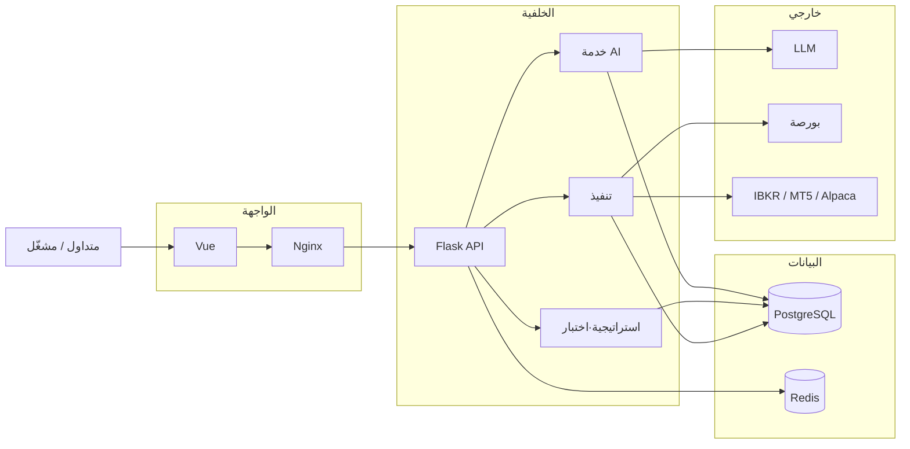

<div align="center" dir="rtl">
  <a href="https://github.com/brokermr810/QuantDinger">
    
  </a>

  <h1>QuantDinger</h1>
  <h3>نظام تشغيل كمّي خاص مدعوم بالذكاء الاصطناعي</h3>
  <p><strong>حزمة واحدة قابلة للنشر للرسوم البيانية، وبحوث السوق بالذكاء الاصطناعي، ومؤشرات واستراتيجيات بايثون، والاختبار الرجعي، والتنفيذ المباشر—على خوادمك ومفاتيح API الخاصة بك.</strong></p>
  <p><em>منصة كمّية ذاتية الاستضافة: من الفكرة والبرمجة بمساعدة الذكاء الاصطناعي إلى سير عمل تجريبي وتداول مباشر متصل بالبورصات، مع خيارات متعددة المستخدمين والفوترة.</em></p>

  <div align="center" style="max-width: 680px; margin: 1.25rem auto 0; padding: 20px 22px 22px; border: 1px solid #d1d9e0; border-radius: 16px;" dir="ltr">
    <p style="margin: 0 0 14px; line-height: 1.65;">
      <a href="../README.md"><strong>English</strong></a>
      <span style="color: #afb8c1;"> · </span>
      <a href="README_CN.md"><strong>简体中文</strong></a>
      <span style="color: #afb8c1;"> · </span>
      <a href="README_JA.md"><strong>日本語</strong></a>
      <span style="color: #afb8c1;"> · </span>
      <a href="README_KO.md"><strong>한국어</strong></a>
      <span style="color: #afb8c1;"> · </span>
      <a href="README_TH.md"><strong>ไทย</strong></a>
      <span style="color: #afb8c1;"> · </span>
      <a href="README_VI.md"><strong>Tiếng Việt</strong></a>
      <span style="color: #afb8c1;"> · </span>
      <a href="README_AR.md"><strong>العربية</strong></a>
    </p>
    <p style="margin: 0 0 18px; padding-bottom: 16px; border-bottom: 1px solid #eaeef2; line-height: 2;">
      <a href="https://ai.quantdinger.com"><strong>SaaS</strong></a>
      <span style="color: #d8dee4;"> &nbsp;·&nbsp; </span>
      <a href="https://www.youtube.com/watch?v=tNAZ9uMiUUw"><strong>فيديو تجريبي</strong></a>
      <span style="color: #d8dee4;"> &nbsp;·&nbsp; </span>
      <a href="https://www.quantdinger.com"><strong>الموقع</strong></a>
      <span style="color: #d8dee4;"> &nbsp;·&nbsp; </span>
      <a href="https://aws.amazon.com/marketplace/pp/prodview-naanrb7d2mbc6"><strong>AWS Marketplace</strong></a>
    </p>
    <p style="margin: 0; line-height: 2;">
      <a href="https://t.me/quantdinger"></a>
      &nbsp;
      <a href="https://discord.com/invite/tyx5B6TChr"></a>
      &nbsp;
      <a href="https://youtube.com/@quantdinger"></a>
      &nbsp;
      <a href="https://x.com/QuantDinger_EN"></a>
    </p>
  </div>

  <p style="margin-top: 1.45rem; margin-bottom: 10px;" dir="ltr">
    <a href="../LICENSE"></a>
    
    
    
    
  </p>
</div>

---

<div dir="rtl">

## جدول المحتويات

[بدء سريع](#بدء-سريع) · [مستودعات ذات صلة](#مستودعات-ذات-صلة) · [MCP / Agent](#mcp--agent-gateway) · [نظرة عامة](#نظرة-عامة-على-المنتج) · [الميزات](#أبرز-الميزات) · [لقطات](#جولة-بصرية) · [البنية](#البنية) · [التثبيت](#التثبيت-والتشغيل-الأول) · [الوثائق](#قائمة-الوثائق) · [أسئلة شائعة](#أسئلة-شائعة) · [الترخيص](#الترخيص)

---

> QuantDinger منصة كمّية **ذاتية الاستضافة وتفضّل المحلي** تجمع **البحث المدعوم بالذكاء الاصطناعي** و**استراتيجيات بايثون الأصلية** و**الاختبار الرجعي** و**التداول المباشر** (عملات مشفّرة، أسهم أمريكية عبر IBKR، فوركس عبر MT5، أسهم / ETF / عملات مشفّرة عبر Alpaca) في **منتج واحد**.

</div>

<div align="center">
  
  <p dir="rtl"><sub><em>حلقة مغلقة من مصادر البيانات إلى المؤشرات والإشارات والاستراتيجيات والاختبار الرجعي وتحليل الذكاء الاصطناعي والتنفيذ.</em></sub></p>
</div>

<div dir="rtl">

## بدء سريع

**المتطلبات:** [Docker](https://docs.docker.com/get-docker/) + Compose و**Git**. **لا حاجة لـ Node.js** (واجهة ويب مُجمَّعة مسبقًا في `frontend/dist`).

### macOS / Linux

</div>

```bash
git clone https://github.com/brokermr810/QuantDinger.git && cd QuantDinger && cp backend_api_python/env.example backend_api_python/.env && chmod +x scripts/generate-secret-key.sh && ./scripts/generate-secret-key.sh && docker-compose up -d --build
```

<div dir="rtl">

إن لم يتوفر `docker-compose` جرّب `docker compose`.

### Windows (PowerShell)

شغّل **Docker Desktop** ثم في PowerShell:

</div>

```powershell
git clone https://github.com/brokermr810/QuantDinger.git
Set-Location QuantDinger
Copy-Item backend_api_python\env.example -Destination backend_api_python\.env
$key = & python -c "import secrets; print(secrets.token_hex(32))" 2>$null
if (-not $key) { $key = & py -c "import secrets; print(secrets.token_hex(32))" 2>$null }
if (-not $key) { Write-Error "أضف Python 3 إلى PATH." }
(Get-Content backend_api_python\.env) -replace '^SECRET_KEY=.*$', "SECRET_KEY=$key" | Set-Content backend_api_python\.env -Encoding utf8
docker-compose up -d --build
```

<div dir="rtl">

### Windows (Git Bash)

في Bash المرفق مع Git for Windows يمكن استخدام أمر السطر الواحد لنظامي macOS/Linux.

---

افتح **`http://localhost:8888`**، سجّل الدخول بـ **`quantdinger` / `123456`**، ثم **غيّر كلمة مرور المسؤول فورًا**. للتفاصيل راجع [التثبيت والتشغيل الأول](#التثبيت-والتشغيل-الأول).

## مستودعات ذات صلة

| المستودع | المحتوى |
|----------|---------|
| **[QuantDinger](https://github.com/brokermr810/QuantDinger)** (هذا المستودع) | الخلفية، Compose، الوثائق، ويب مُجمَّع |
| **[QuantDinger-Vue](https://github.com/brokermr810/QuantDinger-Vue)** | **مصدر الويب** (Vue) — `npm run build` ثم استبدل `frontend/dist` |
| **[QuantDinger-Mobile](https://github.com/brokermr810/QuantDinger-Mobile)** | **عميل الجوال** (مفتوح المصدر) |

</div>

<h2 id="mcp--agent-gateway" dir="rtl">MCP / Agent Gateway</h2>

<div dir="rtl">

لـ **Cursor / Claude Code / Codex**: **Model Context Protocol (MCP)** و**Agent Gateway** (`/api/agent/v1`). التفاصيل الكاملة بالإنجليزية هي المصدر الأساسي:

- [AGENT_QUICKSTART.md](agent/AGENT_QUICKSTART.md) · [AI_INTEGRATION_DESIGN.md](agent/AI_INTEGRATION_DESIGN.md) · [agent-openapi.json](agent/agent-openapi.json)
- خادم MCP: [`../mcp_server/README.md`](../mcp_server/README.md) · PyPI [`quantdinger-mcp`](https://pypi.org/project/quantdinger-mcp/)

**الأمان:** تُسجَّل جميع استدعاءات Agent في سجل التدقيق. رموز التداول (T) افتراضيًا **ورقي فقط**؛ التداول المباشر يتطلب `AGENT_LIVE_TRADING_ENABLED=true` على الخادم و`paper_only=false` على الرمز.

## نظرة عامة على المنتج

بيئة موحّدة **للذكاء الاصطناعي + استراتيجيات بايثون + اختبار رجعي + تداول مباشر** قابلة للاستضافة الذاتية. تُدار الاعتمادات عبر **PostgreSQL** و**`.env`**. تُربط البورصات وIBKR وMT5 وAlpaca ونماذج اللغة عبر متغيرات البيئة.

## جولة بصرية

<table align="center" width="100%" dir="ltr">
  <tr>
    <td colspan="2" align="center">
      <a href="https://www.youtube.com/watch?v=wHIvvv6fmHA">
        
      </a>
      <br/><sub><a href="https://www.youtube.com/watch?v=wHIvvv6fmHA"><strong>▶ مشاهدة العرض</strong></a></sub>
    </td>
  </tr>
  <tr>
    <td width="50%" align="center"><br/><sub>IDE للمؤشرات، الرسوم، الاختبار الرجعي</sub></td>
    <td width="50%" align="center"><br/><sub>تحليل الأصول بالذكاء الاصطناعي</sub></td>
  </tr>
  <tr>
    <td align="center"><br/><sub>بوتات التداول</sub></td>
    <td align="center"><br/><sub>استراتيجيات مباشرة والأداء</sub></td>
  </tr>
</table>

## أبرز الميزات

- **البحث والذكاء الاصطناعي** — تحليل متعدد نماذج اللغة، قوائم المراقبة، السجل؛ NL→كود؛ تكامل **Agent / MCP**.
- **البناء** — `IndicatorStrategy` و`ScriptStrategy` (`on_bar`)؛ واجهة شموع احترافية.
- **التحقق** — اختبار رجعي على الخادم، منحنى رأس المال.
- **التشغيل** — تنفيذ عملات مشفّرة، تداول سريع، IBKR / MT5 / Alpaca (أسهم · ETF · عملات مشفّرة)؛ Telegram وبريد وDiscord وWebhook وغيرها.
- **المنصة** — Docker Compose، Postgres، Redis، OAuth، متعدد المستخدمين، أرصدة/عضوية/USDT.

## البنية

</div>



<div dir="rtl">

## التثبيت والتشغيل الأول

1. استنسخ المستودع ثم `cp backend_api_python/env.example backend_api_python/.env`
2. **يجب تعيين `SECRET_KEY`** (القيمة الافتراضية تمنع تشغيل الخلفية). Linux/macOS: `./scripts/generate-secret-key.sh`
3. `docker-compose up -d --build`
4. **الويب:** `http://localhost:8888` · **صحة API:** `http://localhost:5000/api/health`
5. غيّر كلمة مرور المسؤول الافتراضية قبل الإنتاج. اضبط **`FRONTEND_URL`** في `backend_api_python/.env` على عنوانك الفعلي.

للميزات الذكية: انسخ قسم **AI / LLM** من `env.example` إلى `.env` وأعد تشغيل الخلفية. قائمة تحقق كاملة في [README الإنجليزي](../README.md) أو [简体中文](README_CN.md).

## قائمة الوثائق

| الوثيقة | الوصف |
|---------|--------|
| [English README](../README.md) | النسخة الكاملة (إنجليزي) |
| [简体中文](README_CN.md) | النسخة الكاملة (صيني مبسّط) |
| [CHANGELOG](CHANGELOG.md) | سجل الإصدارات |
| [Agent سريع](agent/AGENT_QUICKSTART.md) (إنجليزي) | Agent Gateway / أمثلة curl |
| [دليل الاستراتيجية (إنجليزي)](STRATEGY_DEV_GUIDE.md) | تطوير استراتيجيات المؤشر/السكربت |

أخرى: [multi-user-setup.md](multi-user-setup.md) · [IBKR](IBKR_TRADING_GUIDE_EN.md) · [MT5](MT5_TRADING_GUIDE_EN.md) — التفاصيل غالبًا بالإنجليزية.

## أسئلة شائعة

**هل يمكن الاستضافة الذاتية حقًا؟** نعم، عبر Docker Compose على بنيتك.

**هل للعملات المشفّرة فقط؟** لا. يدعم IBKR / Alpaca (أسهم · ETF · عملات مشفّرة) وMT5 (فوركس).

**هل يمكن كتابة استراتيجيات بايثون؟** نعم، `IndicatorStrategy` و`ScriptStrategy`.

**الاستخدام التجاري؟** الخلفية **Apache 2.0**. الواجهة [QuantDinger-Vue](https://github.com/brokermr810/QuantDinger-Vue) بترخيص منفصل—اقرأه قبل الاستخدام التجاري. الجوال وفق [QuantDinger-Mobile](https://github.com/brokermr810/QuantDinger-Mobile).

**هل يوجد تطبيق جوال؟** راجع [QuantDinger-Mobile](https://github.com/brokermr810/QuantDinger-Mobile).

## روابط إحالة للبورصات (مرجعية)

| البورصة | الرابط |
|---------|--------|
| Binance | [تسجيل](https://www.bsmkweb.cc/register?ref=QUANTDINGER) |
| OKX | [تسجيل](https://www.xqmnobxky.com/join/QUANTDINGER) |
| Bybit | [تسجيل](https://partner.bybit.com/b/DINGER) |

## الترخيص

- الخلفية: **Apache License 2.0** ([`../LICENSE`](../LICENSE))
- واجهة الويب المرفقة: توزيع مُجمَّع. المصدر في [QuantDinger-Vue](https://github.com/brokermr810/QuantDinger-Vue) (ترخيص منفصل)
- العلامات التجارية: [`../TRADEMARKS.md`](../TRADEMARKS.md)

## إخلاء مسؤولية

QuantDinger مخصّص للبحث والتعليم والتداول المتوافق مع القانون **الشرعي**. **ليس نصيحة استثمارية.** الاستخدام على مسؤوليتك.

## المجتمع

- [Telegram](https://t.me/quantdinger) · [Discord](https://discord.com/invite/tyx5B6TChr) · [Issues](https://github.com/brokermr810/QuantDinger/issues)
- البريد: [support@quantdinger.com](mailto:support@quantdinger.com)

## اتجاه النجوم

[](https://star-history.com/#brokermr810/QuantDinger&Date)

## شكر وتقدير

شكرًا لمجتمعات المصدر المفتوح مثل Flask وPandas وCCXT وVue.js وKLineCharts وECharts.

<p align="center"><sub>إن كان المشروع مفيدًا، نرحب بنجمة على GitHub.</sub></p>

</div>
